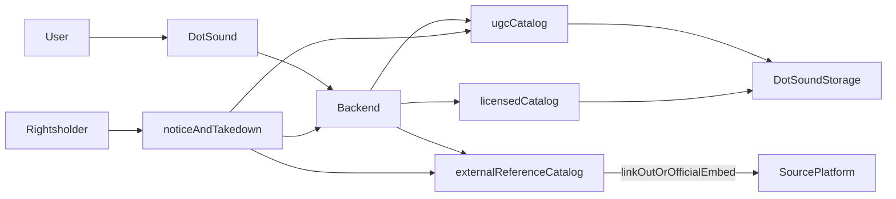

# DotSound — юридико-архитектурный аудит для РФ

Дата: 2026-04-15

Статус документа: рабочий итоговый аудит по текущему коду и целевой модели `source-first`

## 0. Главный вывод

Текущий проект в обнаруженной реализации нельзя считать безопасно готовым к публичному запуску в РФ как музыкальную платформу. Главные причины:

- `UGC` хранится в вашей инфраструктуре, а значит нужна полноценная модель информационного посредника с takedown, офертой, логами акцепта и privacy-compliance.
- Текущий `SoundCloud` flow не является чистым `source-first`: DotSound создает локальные сущности треков и отдает пользователю playback через собственный flow, а не просто переводит его к источнику.
- Юридические тексты фронтенда местами противоречат фактической архитектуре.
- Жалобный flow пока неполный для модели правообладательского уведомления.

При этом желаемая вами модель сама по себе не выглядит автоматически незаконной:

- DotSound хранит только метаданные внешних треков.
- DotSound не копирует аудио сторонних сервисов на свои серверы.
- DotSound не делает `HLS`, не кэширует офлайн, не транскодирует внешний аудиофайл.
- DotSound везде явно показывает источник и ссылку на оригинал.
- Пользователь слушает трек у источника или через официальный механизм источника, а не через независимый storage-backed playback DotSound.

В такой модели проект можно защищать как сервис с внешними reference-объектами и `source-first` доступом. Это не обнуляет риск, но резко снижает его по сравнению с rehost/import моделью.

## 1. Что такое `source-first`

`Source-first` в этом документе означает:

- внешний источник первичен;
- DotSound не присваивает внешний аудиоконтент себе;
- DotSound хранит только метаданные, ссылку на оригинал и признаки источника;
- DotSound не должен превращаться в самостоятельный on-demand стриминг поверх чужого каталога.

Самая важная оговорка:

- не используйте в юридических текстах формулировку `мы ретранслируем сторонние треки`.

Почему:

- в российском праве само слово `ретрансляция` связано с отдельным способом использования;
- если фактически ваш плеер внутри DotSound получает прямой stream URL стороннего сервиса и воспроизводит его как часть собственного UX, это уже не чистый `source-first` и это значительно рискованнее, чем `open original source` или официальный embed.

Безопаснее использовать формулировки:

- `DotSound отображает метаданные и ссылку на оригинальный источник`
- `прослушивание осуществляется на стороне оригинального источника`
- `DotSound не хранит и не размещает аудиофайл внешнего трека на своих серверах`

## 2. Итоговый ответ на главный вопрос

### Будет ли проект незаконным в РФ при целевой модели?

Короткий ответ: `нет, не автоматически`.

Но только если соблюдаются все красные линии ниже:

- внешние треки не копируются в `MinIO` или иное ваше хранилище;
- для внешних треков нет локального `file_key`, `hls_manifest_key`, кэша и офлайн-режима;
- DotSound не делает собственную транскодирующую или proxy-streaming инфраструктуру для стороннего аудио;
- прослушивание идет через `link-out` или официальный допустимый embed/player механизма источника;
- внешний трек всегда помечен как внешний, со ссылкой на оригинал;
- при жалобе правообладателя внешний reference может быть оперативно скрыт;
- сервис не утверждает, что внешний трек является собственным контентом DotSound.

Если хотя бы один из пунктов нарушается, риск быстро растет.

### Когда ответ меняется на плохой

Проект снова уходит в высокорисковую зону, если:

- ваш backend сам получает stream URL стороннего сервиса и ваш собственный player воспроизводит этот поток внутри DotSound;
- вы строите общий каталог `слушать здесь` из чужих источников;
- вы делаете автоподбор, radio и daily mix таким образом, что пользователь почти не замечает внешний характер контента;
- вы начинаете копировать, кэшировать, транскодировать, нормализовать или офлайн-хранить внешний аудиофайл.

Для `SoundCloud` добавляется отдельный риск: даже если российско-правовая позиция еще обсуждаема, такая модель может конфликтовать с их API/Terms, где чувствительны `alternative on-demand listening service`, persistent storage, aggregation и самостоятельный playback поверх их user content.

## 3. Резюме рисков

| Аспект                                                     | Текущий код                                        | Целевая `source-first` модель                                        | Оценка риска                                     | Почему                                                                                                       |
| ---------------------------------------------------------- | -------------------------------------------------- | -------------------------------------------------------------------- | ------------------------------------------------ | ------------------------------------------------------------------------------------------------------------ |
| `SoundCloud import`                                        | Локальная запись трека + собственный playback flow | Только metadata + source URL + link-out / official embed             | `High` в текущем виде, `Medium` в целевом        | В текущей реализации DotSound не просто индексирует ссылку, а строит собственный UX доступа к внешнему аудио |
| Хранение внешнего аудио                                    | Сейчас для SC аудио не копируется                  | Не хранить вообще                                                    | `Low` при строгом соблюдении                     | Отсутствие storage резко улучшает позицию                                                                    |
| Воспроизведение внешнего трека внутри собственного player  | Есть риск именно в эту сторону                     | Не использовать свой player для независимого playback внешнего аудио | `High`                                           | Это уже ближе к собственному on-demand доступу, а не к нейтральной ссылке                                    |
| `UGC upload`                                               | Аудио реально хранится и транскодируется           | Оставить как отдельный UGC-контур                                    | `Medium` при сильной правовой обвязке            | Это допустимая модель, но только с офертой, takedown, privacy, логами акцепта и модерацией                   |
| Жалобный flow                                              | Неполный                                           | Полный notice-and-takedown по `149-ФЗ` и логированию                 | `High` сейчас, `Medium` после доработки          | Сейчас модель и форма жалоб не покрывают весь required evidence/data flow                                    |
| `/legal` и дисклеймеры                                     | Противоречат архитектуре                           | Переписать под фактическую модель                                    | `High` сейчас                                    | Нельзя писать `мы не храним аудио`, если UGC-хранилище реально существует                                    |
| Рекомендации по внешним reference                          | Возможны                                           | Допустимы только как рекомендации ссылок/источников                  | `Medium`                                         | Риск растет, если рекомендации превращают внешний каталог в ваш собственный продукт                          |
| `enrich_user_catalog` как автообогащение внешнего каталога | В коде не найден                                   | Не внедрять в активной форме                                         | `High` как архитектурный сценарий                | Платформа сама начинает отбирать и добавлять чужой контент                                                   |
| Privacy / `152-ФЗ`                                         | Не оформлено как полноценный legal package         | Сделать отдельный privacy contour                                    | `High` сейчас, `Medium` после внедрения          | Для Telegram Mini App и форм нужен отдельный PDn-compliance слой                                             |
| Общая модель по РФ                                         | Смешанная и противоречивая                         | Разделить `UGC`, `licensed`, `external_reference`                    | `High` сейчас, `Medium` при строгом source-first | Законность будет зависеть от фактической архитектуры, а не от лозунга `мы только показываем ссылки`          |

## 4. Ключевая правовая логика

### 4.1. Что подтверждают нормы

- `ст. 1253.1 ГК РФ` защищает информационного посредника не автоматически, а при соблюдении условий.
- `ст. 1270 ГК РФ` относит к использованию не только копирование, но и `доведение до всеобщего сведения`.
- `ст. 1317 ГК РФ` и нормы о фонограммах добавляют смежные права, которые тоже могут нарушаться.
- `149-ФЗ`, `ст. 15.7` важна тем, что правообладатель может требовать удаления не только самого объекта, но и `информации, необходимой для его получения`.

Отсюда ключевой вывод:

- аргумент `мы не храним mp3 у себя` помогает, но сам по себе не закрывает риск.

### 4.2. Что подтверждает практика и здравый риск-анализ

- В свежей практике по `доведению до всеобщего сведения` суды смотрят на то, кто именно организовал доступ к произведению на своем сайте.
- Для оценки важна не только физическая копия файла, но и то, кто создает пользовательский опыт прослушивания и насколько контент выглядит частью собственного сервиса.

### 4.3. Почему `открытый источник` не равно `разрешено использовать`

Очень важное правило:

- `publicly accessible` не равно `public domain`
- `можно открыть в браузере` не равно `можно строить поверх этого свой стриминг`
- `есть ссылка на источник` не равно `есть лицензия или договорное право на in-app playback`

Это особенно важно для `SoundCloud` и аналогичных платформ.

## 5. Рекомендуемая правовая модель

### Модель

Разделить каталог DotSound на три разных слоя:

- `ugcCatalog`
- `licensedCatalog`
- `externalReferenceCatalog`

Правила по слоям:

- `ugcCatalog`: файлы можно хранить и стримить у себя, но только после акцепта оферты, лицензии от пользователя, notice-and-takedown и privacy-compliance.
- `licensedCatalog`: только по прямым договорам или дистрибуции.
- `externalReferenceCatalog`: только метаданные и источник; без хранения аудиофайла и без собственного storage-backed playback.

### Mermaid-схема

### Практический вывод

Если вы хотите `максимально снять риск`, safest-вариант для внешних треков такой:

- `Открыть у источника`

Менее безопасный, но еще обсуждаемый:

- официальный embed/player источника, если это прямо допускается правилами источника

Плохой вариант:

- собственный `play` внутри DotSound поверх stream URL стороннего сервиса

Очень плохой вариант:

- копирование внешнего трека в ваше storage

## 6. Конкретные изменения

### Блокер

1. Разделить внешние reference-треки и внутренние хранимые треки.

Файлы:

- `app/models/track.py`
- `app/schemas/track.py`
- `frontend/src/types/api.ts`

Что менять:

- ввести отдельный признак режима доступа, например `access_mode = internal_stream | official_embed | external_link`;
- не считать `source=soundcloud` playable только потому, что можно вытащить stream URL;
- добавить явные поля provenance: `canonical_source_url`, `source_platform`, `source_display_name`, `external_play_policy`, `rights_status`.

1. Убрать собственный playback внешних треков из `SoundCloud` flow.

Файлы:

- `app/api/v1/tracks/playback.py`
- `app/services/soundcloud_service.py`
- `app/api/v1/soundcloud.py`
- `frontend/src/lib/api.ts`

Что менять:

- прекратить возвращать внешний stream URL как обычный DotSound playback URL;
- заменить поведение на `open original source` или `official embed only`;
- на уровне API возвращать не `stream` для external-reference, а `external_access` объект.

1. Переписать `/legal` и все дисклеймеры под реальную архитектуру.

Файлы:

- `frontend/src/views/LegalView.tsx`
- `frontend/src/components/TrackCard/TrackCard.tsx`
- `frontend/src/components/TrackCardSheet/TrackCardSheet.tsx`

Что менять:

- убрать ложную формулировку `сервис не осуществляет хранение аудиофайлов`, потому что для `UGC` это неверно;
- разделить тексты для `UGC` и для `externalReference`;
- везде явно показывать источник и природу доступа.

1. Довести complaint/takedown до полноценного правообладательского flow.

Файлы:

- `app/models/complaint.py`
- `app/schemas/complaint.py`
- `app/repositories/complaint.py`
- `app/services/complaint_service.py`
- `app/api/v1/complaints.py`
- `frontend/src/components/ComplaintModal/ComplaintModal.tsx`

Что менять:

- реально сохранять `reason_type`, `rightsholder_name`, `proof_url`;
- добавить fields для сведений, требуемых по `149-ФЗ` notice;
- отделить обычную пользовательскую жалобу от правообладательского уведомления;
- добавить SLA-поля и журнал рассмотрения.

1. Ввести acceptance flow для `UGC`.

Файлы:

- `frontend/src/components/Upload/UploadFileTab.tsx`
- новые markdown/legal docs
- backend-модель акцепта условий

Что менять:

- обязательный чекбокс с заверением о правах;
- лог версии оферты/политики, которую принял пользователь;
- запретить загрузку без акцепта условий.

### Важно

1. Собрать полноценный legal package в проекте.

Создать:

- `docs/legal/USER_AGREEMENT.md`
- `docs/legal/PRIVACY_POLICY.md`
- `docs/legal/COPYRIGHT_POLICY.md`
- `docs/legal/UPLOAD_RULES.md`
- `docs/legal/LEGAL_TEXTS.md`
- в корне проекта `LEGAL.md` как индекс

1. Разделить пользовательские действия и rights workflow.

Файлы:

- `frontend/src/components/ComplaintModal/ComplaintModal.tsx`
- `frontend/src/views/LegalView.tsx`

Что менять:

- отдельная ссылка `Правообладателям`;
- отдельная форма `уведомление правообладателя`;
- отдельная форма `жалоба пользователя`.

1. Ограничить рекомендации по внешним reference.

Файлы:

- `app/services/recommendation_service.py`
- frontend экраны выдачи

Что менять:

- разрешить рекомендовать внешние reference только как ссылки на источник;
- не autoplay such content inside internal player;
- не смешивать внешний reference и внутренний storage-backed трек как будто это один и тот же тип объекта.

1. Privacy / `152-ФЗ`.

Нужно:

- отдельная политика обработки персональных данных;
- отдельные согласия в формах, где это требуется;
- логирование акцепта;
- публичные реквизиты оператора;
- процедура отзыва согласия и обращения по ПДн.

### Желательно

1. Создать отдельный `licensedCatalog`.

Это даст самый сильный путь роста без постоянной зависимости от спорной внешней модели.

1. Не внедрять `enrich_user_catalog` для внешних треков.

Если и делать enrichment, то:

- только для `licensed` или `ugc` сегмента;
- или в виде рекомендаций ссылок, а не автоматического включения внешних треков в полноценный DotSound catalog.

1. Повторные нарушения.

Нужно:

- политика repeat infringer;
- escalation для аккаунтов, систематически загружающих чужой контент.

## 7. Готовые тексты

### 7.1. Дисклеймер для внешнего трека

Короткий вариант:

> Внешний источник: SoundCloud. DotSound хранит только метаданные и ссылку на оригинал. Аудиофайл размещается и предоставляется третьим лицом. Правообладатель может направить уведомление об ограничении доступа через страницу «Правообладателям».

Строгий `source-first` вариант:

> DotSound отображает метаданные этого трека и ссылку на оригинальный источник. Прослушивание осуществляется на стороне оригинального источника. DotSound не хранит аудиофайл данного внешнего трека на своих серверах и не предоставляет его офлайн-копию.

### 7.2. Текст на странице `Правообладателям`

> DotSound является сервисом, в котором могут присутствовать:
>
> 1. пользовательские материалы, загруженные пользователями DotSound;
> 2. материалы, на которые DotSound имеет отдельные договорные права;
> 3. внешние reference-материалы, для которых DotSound хранит только метаданные и ссылку на оригинальный источник.
>
> Если вы считаете, что в сервисе нарушаются ваши авторские или смежные права, вы можете направить уведомление с указанием:
>
> - сведений о правообладателе или его представителе;
> - сведений об объекте прав;
> - ссылки на страницу DotSound, где размещена спорная информация;
> - подтверждения прав;
> - указания на отсутствие разрешения на соответствующее размещение или предоставление доступа.
>
> После получения надлежаще оформленного уведомления DotSound принимает меры по проверке и, при необходимости, ограничению доступа в предусмотренные законом сроки.

### 7.3. Чекбокс для `UGC upload`

> Я подтверждаю, что обладаю необходимыми правами или полномочиями на загрузку данного аудиоматериала, обложки и иных вложений, и соглашаюсь с Пользовательским соглашением, Правилами загрузки контента и Политикой обработки персональных данных.

### 7.4. Ключевые пункты пользовательского соглашения

1. Пользователь гарантирует, что обладает всеми необходимыми правами на загружаемый контент или имеет надлежащее разрешение правообладателя.
2. Пользователь обязуется не загружать материалы, нарушающие авторские, смежные, личные неимущественные и иные права третьих лиц.
3. Пользователь предоставляет DotSound неисключительную лицензию, необходимую только для хранения, обработки, транскодирования, показа и предоставления доступа к контенту в рамках сервиса.
4. DotSound вправе временно ограничить доступ к контенту или удалить его при получении жалобы, уведомления правообладателя, наличии признаков нарушения прав или иных нарушений соглашения.
5. Пользователь соглашается, что за нарушения прав третьих лиц ответственность перед такими лицами в первую очередь несет пользователь, загрузивший контент, без исключения обязанностей DotSound, прямо предусмотренных законом.
6. DotSound вправе применять меры к аккаунтам, систематически нарушающим правила сервиса, включая ограничение загрузки, скрытие материалов и блокировку.

### 7.5. Текст для внешнего `save/import`

Не использовать:

> Импортировать трек на DotSound

Лучше:

> Сохранить ссылку на источник

или:

> Добавить внешний трек

Подсказка:

> DotSound сохранит метаданные и ссылку на оригинальный источник. Внешний аудиофайл не копируется на серверы DotSound.

## 8. Дорожная карта

### Этап 1. Немедленно

- остановить развитие current external playback как обычного внутреннего стриминга;
- зафиксировать целевую модель `source-first`;
- переписать `/legal` и дисклеймеры;
- закрыть gaps в complaints/rightsholder notice flow.

### Этап 2. До публичного запуска

- внедрить `USER_AGREEMENT`, `PRIVACY_POLICY`, `COPYRIGHT_POLICY`, `UPLOAD_RULES`;
- добавить acceptance logging;
- разделить `UGC`, `licensed`, `externalReference` на уровне модели и API;
- исключить внешний audio caching/offline behavior.

### Этап 3. После стабилизации

- внедрить repeat infringer policy;
- провести отдельную проверку всех внешних источников на соответствие terms;
- подготовить шаблоны договоров с инди-артистами/лейблами.

## 9. Что обновить в agent-facing markdown

Следующие документы должны быть синхронизированы с новым legal-readiness подходом:

- `AGENTS.md`
- `docs/ai-boundary-policy.md`
- `TODO.md`

Что туда добавить:

- запрет писать UI-тексты, противоречащие реальной архитектуре;
- правило `external audio != internal track`;
- правило `source-first`: без storage, transcoding, offline и independent playback для внешних треков;
- обязательную проверку legal docs при изменениях в `upload`, `import`, `complaints`, `recommendation`, `playback`.

## 10. Финальный вердикт

### В текущем виде

`High risk`. Я не рекомендую публичный запуск в РФ без переработки external-source части и без legal package.

### В желаемой вами модели

Если DotSound:

- хранит только метаданные внешних треков;
- всегда показывает ссылку на источник;
- не хранит внешний аудиофайл;
- не кэширует и не транскодирует его;
- не выдает его как собственный внутренний playback;
- имеет полноценную модель notice-and-takedown;
- оформляет `UGC` и персональные данные отдельно и корректно;

то проект не выглядит автоматически незаконным в РФ.

Но:

- нулевого риска не будет;
- формулировку `мы ретранслируем` использовать не надо;
- для `SoundCloud` и аналогичных сервисов остается договорный риск по правилам самих платформ;
- safest версия внешнего контента для вас — `metadata + source link + open original source`, а не `play here`.

### Самая важная практическая формула

`reference + attribution + link-out + takedown = обсуждаемо и жизнеспособно`

`own player over third-party streams = высокий риск`

`rehost to your storage = критический риск`