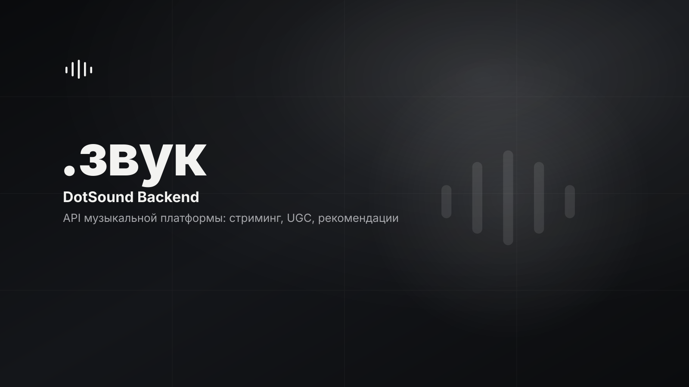

# DotSound Backend

<p>
  
  
  
  <!-- loc:start --><!-- loc:end -->
</p>



Бэкенд музыкальной платформы DotSound: загрузка и стриминг UGC-аудио, импорт внешних треков, рекомендации, плейлисты, тексты песен и админ-панель. Архитектура Telegram-style - открытый клиент и транспорт, закрытое ядро: этот репозиторий публикует API, хранение и оркестрацию, а бизнес-правила и security-константы живут в закрытом ядре и подключаются как opaque-зависимость. Раздаёт React Mini App, метаданные в PostgreSQL, медиа - в MinIO.

## Что внутри

Платформа покрыта API v1 (REST + WebSocket, ~30 доменов роутов) и ~25 фоновыми Taskiq-воркерами поверх PostgreSQL (121 Alembic-миграция, ~70 ORM-моделей, отдельный слой repositories).

- **Загрузка и хранение**: обычная и chunked (resumable, S3 multipart) загрузка с валидацией MIME (python-magic) и ClamAV-сканом; контент-адресное хранилище в MinIO с дедупликацией по SHA-256 и ref-counting, пользовательские квоты.
- **Транскодинг и деривативы**: FFmpeg - progressive MP3 + адаптивный HLS (две дорожки), нормализация громкости; на каждый трек - waveform (200 столбцов), сниппет/превью и процедурная обложка; on-demand нормализация UGC-воспроизведения.
- **Воспроизведение**: presigned URL, range-стриминг, HLS с adaptive bitrate (hls.js); egress-пул для байтового стриминга стороннего аудио (sticky-binding, quarantine, back-off), health-мониторинг с авто-repair и prefetch следующих треков.
- **Импорт**: импорт треков, плейлистов и лайков из внешних музыкальных сервисов и по ссылке; очередь с диспетчером и лимитами (глобально / на пользователя), backfill артистов и каталога, отложенная верификация воспроизводимости, in-app уведомления о завершении (RU/EN).
- **Рекомендации**: персональная лента и главный экран (8-10 секций), Daily / Weekly Mix, жанровые миксы, «Выбор пользователей», радио (seed-first) и похожие треки; прогрев кеша и телеметрия impressions ↔ listen для обратной связи. Скоринг и эвристики - в приватном ядре.
- **Артисты**: карточки с обогащением (статус и уверенность), мульти-источниковая атрибуция (`source_name`, `source_page_url`), синхронизация каталога, месячная статистика (слушатели, прослушивания, лайки, подписчики), подписки.
- **Тексты и инфо о треке**: панель с обычным и синхронизированным (тайм-коды) текстом и атрибуцией источника; каскад получения с audio-based fallback (внутренние стадии - в ядре); панель информации о треке с атрибуцией провайдера.
- **Поиск**: Elasticsearch 8 - полнотекст по трекам и артистам, автодополнение (SAYT), транслитерация RU↔LAT, fuzzy; фоновая индексация и drain счётчиков прослушиваний из Redis.
- **Социальное**: лайки/дизлайки и очередь из лайков, плейлисты (CRUD + автогенерация коллажа-обложки), подписки на пользователей и артистов, блокировки, жалобы с авто-скрытием трека по порогу, уведомления, onboarding и персональная статистика слушателя.
- **Realtime**: WebSocket с Redis pub/sub для multi-instance (до 6 соединений на пользователя), доставка уведомлений, presence и онлайн-статус.
- **Аутентификация**: JWT + Telegram HMAC (initData), cookie-сессии с CSRF, email-аутентификация (magic link + OTP), 2FA (TOTP) с backup-кодами, привязка внешних аккаунтов (токены шифруются Fernet), удаление аккаунта с grace-периодом и анонимизацией.
- **Админ-панель**: ~28 модулей - модерация треков/пользователей/жалоб, dashboard и метрики, аудит-лог всех мутаций, управление задачами / импортом / текстами, контроль compute-воркеров; секретный путь (`ADMIN_PANEL_PATH`), защищённый admin-бандл.
- **Безопасность / anti-abuse**: rate limiting (slowapi + Redis), security headers и CSP, SSRF-guard, allowlist внутренних API по CIDR, abuse-сигналы и фингерпринт, проверка Tor / одноразовых email, step-up и device-pinning для админа. Константы и decision-функции - в приватном ядре.
- **Compute-воркер**: pull-based протокол (claim / heartbeat / progress / result / fail) с HMAC, IP-allowlist и одноразовыми токенами на скачивание аудио; лизы задач, детектор аномалий и авто-suspend.
- **Наблюдаемость**: structlog (JSON, редакция секретов), 50+ Prometheus-метрик, OpenTelemetry (FastAPI + SQLAlchemy), Sentry с PII-фильтром, observability-стек (Grafana / Loki / Tempo); cron-планировщик (croniter + leader-lock), очистка фоновых задач, бэкапы Postgres/Redis.
- **Тесты**: pytest + anyio, ~250 тест-файлов, enforced branch coverage 95%.

Часть P2P-функций (чаты, комментарии, личные сообщения, совместное прослушивание) намеренно отключена по регуляторным причинам и помечена в коде (`docs/REGULATORY_DISABLED.md`).

## Запуск

Полный локальный запуск требует соседний приватный пакет ядра. Публичный showcase-клон без него предназначен для чтения кода и архитектурного review, а не для production/development.

```bash
poetry install                 # требует соседний приватный пакет ядра
cp .env.example .env
make dev                       # Postgres + MinIO + Redis, миграции, сервер :8000
```

http://localhost:8000/docs - Swagger UI (dev-режим).

Mini App (Telegram WebApp, React + Vite):

```bash
cd frontend
npm install
npm run dev                    # http://localhost:5173/mini_app/
```

Сборка `npm run build` кладёт бандл в `app/static/mini_app/`, откуда его раздаёт FastAPI.

## Команды

| Команда | Назначение |
|---------|------------|
| `make dev` | Инфра + миграции + backend на :8000 (autoreload) |
| `make dev-full` | `dev` + сид локального compute-воркера |
| `make infra` | Поднять Postgres + MinIO + Redis |
| `make migrate` | `alembic upgrade head` |
| `make test` | `pytest -v` |
| `make test-cov` | pytest + branch coverage (gate 95%) |
| `make test-fast` | Без `slow`/`s3`/`redis`-тестов |
| `make lint` | Ruff + Black `--check` + mypy strict |
| `make format` | Black + Ruff `--fix` |
| `make bootstrap-admin` | Выдать admin-права пользователю |
| `make observability-up` | Prometheus + Grafana + Loki + Tempo |
| `make prod-deploy` | Продакшн-деплой (`scripts/deploy.sh`) |

## Стек

<p>
  
  
  
  
  
  
  
  
  
  
  
  
  
  
</p>

## Тесты

```bash
make test            # pytest -v
make test-cov        # branch coverage, gate 95%
make lint            # ruff + black --check + mypy strict
```

Конвенция: `tests/app/...` зеркалит `app/...`, async через `pytest.mark.anyio`, общие фабрики - `tests/factories.py`.

## Архитектура

Telegram-style: открытый клиент, открытый транспорт, приватное ядро. Backend (`app/`) - транспортный слой: маршрутизация, работа с PostgreSQL / Redis / MinIO / Elasticsearch, Pydantic-схемы и оркестрация фоновых задач. Бизнес-правила, security-константы и decision-функции живут в закрытом ядре и подключаются как opaque-зависимость. Внутри backend - строгие слои `api/v1 → services → repositories → models`.

```
DotSoundBackend/
├── app/
│   ├── api/v1/          # HTTP-граница: auth, tracks, playlists, recommendations,
│   │                    #   lyrics, artists, albums, imports, search, admin, ws
│   ├── services/        # оркестрация + Taskiq-воркеры (транскодинг, импорт, lyrics…)
│   ├── repositories/    # доступ к БД: только запросы, без бизнес-решений
│   ├── models/          # SQLAlchemy ORM
│   ├── schemas/         # Pydantic запрос/ответ
│   ├── core/            # БД, S3, auth, rate limit, observability, Taskiq
│   ├── middlewares/     # security headers, CSRF, admin audit, internal allowlist
│   └── search/          # Elasticsearch: клиент, индексы, транслитерация
├── alembic/             # 121 миграция
├── frontend/            # React 18 + Vite Mini App → app/static/mini_app/
├── scripts/             # operational helpers, deploy/backup
├── docs/                # политики границ, legal, протоколы воркеров
├── tests/               # pytest + anyio, зеркало app/
├── docker-compose.yml   # Postgres, MinIO, Redis, Elasticsearch, worker, …
└── pyproject.toml
```

- **api/v1 без SQL**: маршруты не содержат `select()` / `session.execute()` - только вызов сервиса
- **Правила в ядре**: бизнес-решения и security-константы - в закрытом ядре, backend = транспорт
- **Black-box**: внутренняя реализация ядра не называется в коде, логах и docs (`docs/ai-boundary-policy.md`)
- **Слои**: `services` зовёт закрытое ядро и repositories; `repositories` - чистый SQL без решений
- **Конфиг**: только через `app/config.py` (pydantic-settings); прямой `os.environ` запрещён
- **Секреты**: `.env` агенту недоступен; имена переменных - только в абстракции

## Лицензия

© 2026 DotSound. Source-available, **не** open source.

Просмотр и не-production оценка кода (interview, portfolio, security review) разрешены. Production-использование, коммерческая эксплуатация, SaaS-хостинг, redistribution, производные продукты и обучение ML-моделей - только с письменного разрешения правообладателя. Закрытое ядро платформы не публикуется. См. [LICENSE](LICENSE) и [NOTICE](NOTICE).
