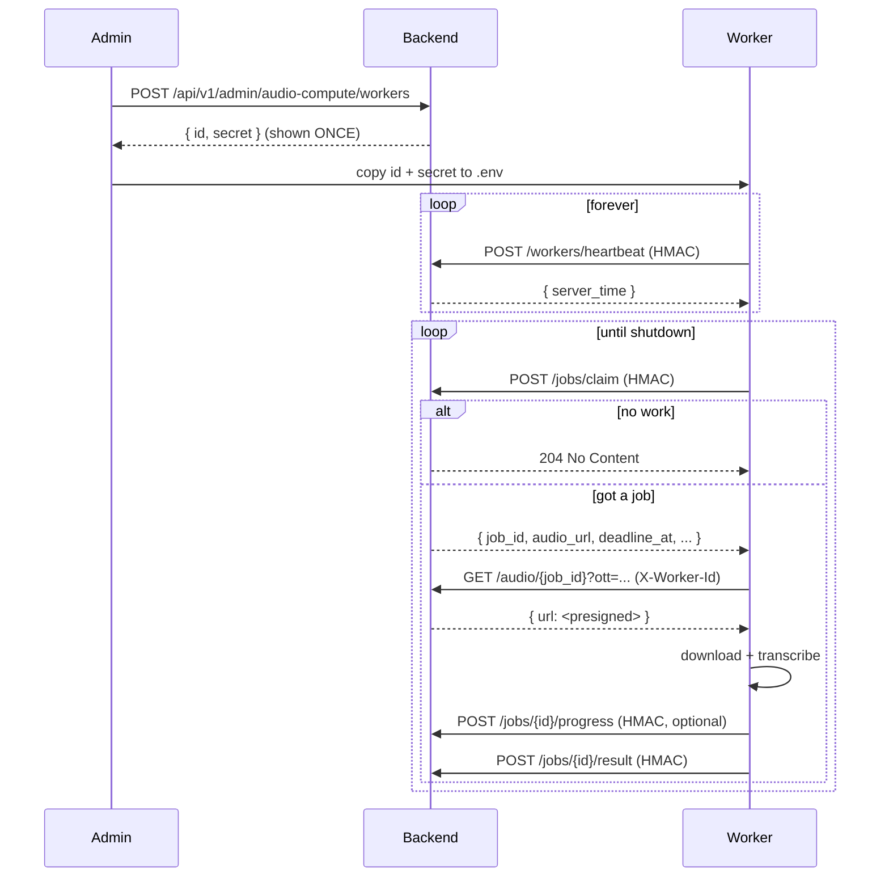

# Compute worker protocol

Wire contract for any process that wants to act as a remote ASR
worker against this Backend. The reference implementation lives
in `DotSoundComputeWorker`; this document is the source of truth
when the implementations disagree.

## Lifecycle



## Endpoints

All endpoints are mounted under `/api/v1/internal/audio-compute/`.
Access is gated by the global IP allowlist
(`internal_api_allowed_cidrs`) **and** the per-worker
`allowed_ip_cidrs` JSON column. A request can be rejected at
either layer.

| Method | Path | Purpose |
|--------|------|---------|
| POST | `/workers/heartbeat` | "I am alive" — bumps `last_seen_at` |
| POST | `/jobs/claim` | Atomically lease the next queued job |
| POST | `/jobs/{job_id}/progress` | Stream stage updates / partial text |
| POST | `/jobs/{job_id}/result` | Final lyrics, marks job done |
| POST | `/jobs/{job_id}/fail` | Worker abandons the job; cascade may retry |
| GET | `/audio/{job_id}?ott=...` | Resolve OTT into a presigned S3 URL |

### Per-action rate limits (default)

| Endpoint | Quota |
|---|---|
| `/workers/heartbeat` | 12/min |
| `/jobs/claim` | 30/min |
| `/jobs/{id}/result` | 30/min |
| `/jobs/{id}/progress` | 60/min |
| `/jobs/{id}/fail` | 30/min |
| `/audio/{id}` | 10/min per worker |

Three quota busts inside a 10-minute window auto-suspend the
worker for 5 minutes (configurable). The audit log records each
strike; the admin UI can lift the suspension via rotate-secret.

## Authentication

Every signed call carries six headers:

| Header | Value |
|---|---|
| `X-Worker-Id` | The worker's id (e.g. `w_8a2b...`) |
| `X-Timestamp` | Unix seconds, UTC |
| `X-Nonce` | Random 32-hex-char string, unique per call |
| `X-Worker-Signature` | HMAC-SHA256 (see below) |
| `X-Worker-Signature-Version` | `1` |
| `Content-Type` | `application/json` |

### Signature

Build a canonical string and HMAC it with the **SHA-256 of the
raw secret** (not the raw secret itself — the Backend stores
this hash as `token_hash` and uses it as the HMAC key):

```text
canonical = METHOD + "\n" + PATH + "\n" + TIMESTAMP + "\n" + NONCE + "\n" + sha256(BODY)
key       = sha256(raw_secret).hexdigest()
signature = hmac_sha256(key, canonical).hexdigest()
```

Where `BODY` is the **exact bytes** the worker sends; for empty
bodies it is `b""` (yes, sha256 of `b""` is allowed and required).
Ordering and case matter: `METHOD` must be upper-case.

#### Python example

```python
import hashlib, hmac, json, secrets, time

raw_secret = "..."                         # WORKER_SECRET
ts = str(int(time.time()))
nonce = secrets.token_hex(16)
body = json.dumps({"reason": "manual"}).encode()
path = "/api/v1/internal/audio-compute/jobs/abc/fail"

body_sha = hashlib.sha256(body).hexdigest()
canonical = f"POST\n{path}\n{ts}\n{nonce}\n{body_sha}".encode()
key = hashlib.sha256(raw_secret.encode()).hexdigest().encode()
signature = hmac.new(key, canonical, hashlib.sha256).hexdigest()
```

#### curl example

```bash
TS=$(date +%s)
NONCE=$(openssl rand -hex 16)
BODY=""
BODY_SHA=$(printf "%s" "$BODY" | openssl dgst -sha256 -hex | cut -d' ' -f2)
PATH_STR="/api/v1/internal/audio-compute/jobs/claim"
KEY=$(printf "%s" "$WORKER_SECRET" | openssl dgst -sha256 -hex | cut -d' ' -f2)
SIG=$(printf "POST\n%s\n%s\n%s\n%s" "$PATH_STR" "$TS" "$NONCE" "$BODY_SHA" \
  | openssl dgst -sha256 -hmac "$KEY" -hex | cut -d' ' -f2)

curl -X POST "https://api.example.com$PATH_STR" \
  -H "X-Worker-Id: $WORKER_ID" \
  -H "X-Timestamp: $TS" \
  -H "X-Nonce: $NONCE" \
  -H "X-Worker-Signature: $SIG" \
  -H "X-Worker-Signature-Version: 1" \
  -H "Content-Type: application/json"
```

### Replay / clock-skew rules

- `X-Timestamp` must be within ±60 seconds of the Backend's wall
  clock, otherwise the request is rejected as `stale_timestamp`.
- `X-Nonce` is single-use within a 5-minute window per worker
  (Redis dedup); a duplicate nonce is rejected as `nonce_replay`.
- Rotating the secret (admin action) immediately invalidates all
  previously issued nonces.

## Schemas

### `POST /workers/heartbeat`

Request body: empty.

Response 200:

```json
{ "status": "ok", "server_time": 1761234567 }
```

### `POST /jobs/claim`

Request body: empty.

Response 204 — no work right now, back off and retry.

Response 200:

```json
{
  "job_id": "lj_a3f9b21c",
  "track_id": 12345,
  "profile": "gpu_full",
  "progress_id": "p_d8e2",
  "audio_sha256": "abcd...",
  "correlation_id": "lj_a3f9b21c",
  "current_tier": "remote_whisper",
  "deadline_at": "2026-04-22T13:55:00+00:00",
  "audio_url": "/api/v1/internal/audio-compute/audio/lj_a3f9b21c?ott=1761234867.<sig>"
}
```

The Backend also returns `X-Correlation-Id: <correlation_id>`;
echo it back on every callback.

### `GET /audio/{job_id}?ott=...`

Headers: `X-Worker-Id` only — this endpoint is OTT-gated, no
HMAC. The OTT is single-use, expires in 5 minutes, and is pinned
to the worker's last-seen IP. Reusing a consumed OTT or hitting
this endpoint from a different IP returns 404.

Response 200:

```json
{ "url": "https://minio.example/dotsound/...?X-Amz-Signature=..." }
```

### `POST /jobs/{job_id}/progress`

Request body (all fields optional):

```json
{
  "stage": "processing",
  "percent": 42,
  "message": "demucs done, transcribing",
  "partial_text": "Optional cumulative text so far",
  "partial_synced_lines": [
    { "time_ms": 0, "text": "Hello", "confidence": 0.9 }
  ]
}
```

### `POST /jobs/{job_id}/result`

```json
{
  "plain_text": "...",
  "synced_lines": [
    {
      "time_ms": 0,
      "text": "Hello world",
      "confidence": 0.93,
      "word_times": [
        {
          "text": "Hello",
          "start_ms": 0,
          "dur_ms": 410,
          "confidence": 0.95
        }
      ]
    }
  ],
  "sync_quality": "word",
  "sync_profile": "gpu_full",
  "audio_sha256": "abcd..."
}
```

`audio_sha256` (if the job carried one) is cross-checked with the
Backend's stored value; a mismatch is rejected as
`audio_sha_mismatch`.

### `POST /jobs/{job_id}/fail`

```json
{ "reason": "vocal_track_silent" }
```

A failure does not necessarily mark the job dead — the cascade
service may move it to the next tier (`speechkit_paid`) and
re-enqueue. The response indicates whether a fallback happened:

```json
{ "status": "ok", "fallback": true }
```

## Recommended ASR stack

For UGC music tracks (the worst case: heavy bass, distortion,
multi-language) the reference recipe is:

1. **Demucs htdemucs** — split into vocals + accompaniment, keep
   the vocals stem only. Improves Whisper accuracy by 10-30 pp on
   noisy material.
2. **faster-whisper large-v3** — `int8` precision on CPU,
   `float16` on CUDA. Set `vad_filter=true`, `word_timestamps=true`.
3. **Optional WhisperX** — only if you need word-level alignment
   beyond what Whisper-internal timestamps give you.

## Minimum requirements

- Python 3.12
- ffmpeg installed in `$PATH`
- 16 GB RAM if running large-v3 on CPU; 8 GB VRAM if on GPU
- Outbound HTTPS to the Backend (no inbound ports needed)

## Security checklist

- Treat `WORKER_SECRET` like a password. Lose it → rotate
  immediately via admin UI; the Backend will invalidate the
  nonce cache automatically.
- Run the worker container with `--read-only --tmpfs /tmp:size=2G`.
- Lock the worker's `allowed_ip_cidrs` to its specific egress IPs.
- Tail the worker logs for `auth_fail`, `rate_limit_exceeded`,
  `auto_suspend` events; they signal a misbehaving deployment.

## License

The reference worker is MIT-licensed; you can fork it.
