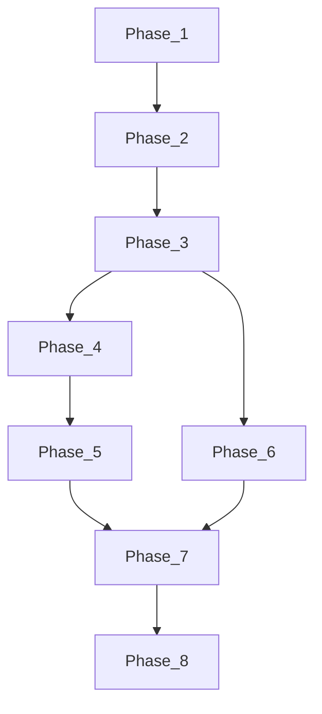

# Artist catalog & SoundCloud discography — этапы выполнения

Временные файлы для передачи контекста между чатами. **После завершения всей цепочки удалите эту папку** (`docs/implementation-plans/artist-catalog-discography/`).

Канонический план: `.cursor/plans/artist_catalog_discography_505ea7d6.plan.md` (корень workspace Cursor; при необходимости скопируйте содержимое в репозиторий отдельно).

---

## Общий контекст задачи (один раз — для всех этапов)

**Продукт:** у артиста в DotSound появляется **каталог релизов**: альбомы/EP/синглы с обложками и **упорядоченными треками** платформы (не путать с user-owned `Album` в БД).

**Источник автосинка:** SoundCloud. Запрос списка альбомов идёт по `**artists.soundcloud_user_id`** (numeric id пользователя SC из API) → `GET …/users/{soundcloud_user_id}/albums`. Внутренний `**artists.id` (PK DotSound) для HTTP к SoundCloud не используется.** Если `soundcloud_user_id` ещё не записан — его поднимаем из payload импорта трека (`user_id` / объект `user`), из permalink или админки.

**Данные:** реляционные таблицы каталога + колонки на `artists`; импорт каждого трека через существующий `**import_or_get_track`**; связь артист–трек через `**TrackArtist`**; фоновые задачи Taskiq для полного и точечного resync.

**Клиенты:** mini app — карточки релизов на профиле артиста → экран альбома → воспроизведение через текущий playback. Админка — CRUD каталога, поиск треков, reorder, resync.

**Границы репозиториев:** основная работа в **DotSoundBackend**; лимиты/константы синка — **DotSoundPrivateCore** (phase 7); Bot/ComputeWorker не обязательны.

---

## Матрица этапов: роль и анти-конфликты

Этап **не должен** переделывать зону соседа. Если что-то упирается в чужой слой — зафиксировать TODO и двигаться только в своей зоне.

| #   | Этап                        | Делает                                             | Не делает (чтобы не конфликтовать)                                                                           |
| --- | --------------------------- | -------------------------------------------------- | ------------------------------------------------------------------------------------------------------------ |
| 1   | Schema & models             | Миграции, модели, FK                               | HTTP SoundCloud, синк, API, UI                                                                               |
| 2   | SC adapter + helper         | Методы API SC, `ensure_soundcloud_ids_for_artist`  | Заполнение `artist_catalog_`* оркестратором синка (это фаза 3)                                               |
| 3   | Sync + Taskiq               | Оркестрация синка, Taskiq, импорт треков в каталог | Публичные роуты REST (фаза 4), админ роуты (фаза 6), фронт (5–6)                                             |
| 4   | Public API                  | Эндпоинты для mini app, схемы                      | Изменение верстки ArtistView (фаза 5); админка (6)                                                           |
| 5   | Mini app UI                 | Карточки релизов, экран альбома, плеер             | Backend-логику синка; админ UI                                                                               |
| 6   | Admin API + UI              | CRUD каталога, resync-кнопки, редактор             | Не переписывать ядро синка без согласования (правки только если API фазы 3–4 не хватает — тогда тонкий слой) |
| 7   | PrivateCore + tests + legal | Лимиты в ядре, тесты, legal при необходимости      | Новые фичи UI                                                                                                |
| 8   | Verify + delete handoff     | Сквозной smoke, удаление этой папки                | Код фичи                                                                                                     |

---

## Порядок запуска (строго по номеру)

| #   | Файл                                                                                                   | Репозиторий                   |
| --- | ------------------------------------------------------------------------------------------------------ | ----------------------------- |
| 1   | [phase-01-schema-and-models.md](phase-01-schema-and-models.md)                                         | DotSoundBackend               |
| 2   | [phase-02-soundcloud-adapter-and-sc-user-helper.md](phase-02-soundcloud-adapter-and-sc-user-helper.md) | DotSoundBackend               |
| 3   | [phase-03-sync-service-and-taskiq.md](phase-03-sync-service-and-taskiq.md)                             | DotSoundBackend               |
| 4   | [phase-04-public-api.md](phase-04-public-api.md)                                                       | DotSoundBackend               |
| 5   | [phase-05-mini-app-ui.md](phase-05-mini-app-ui.md)                                                     | DotSoundBackend (`frontend/`) |
| 6   | [phase-06-admin-api-and-ui.md](phase-06-admin-api-and-ui.md)                                           | DotSoundBackend               |
| 7   | [phase-07-privatecore-tests-legal.md](phase-07-privatecore-tests-legal.md)                             | PrivateCore + Backend         |
| 8   | [phase-08-verify-and-delete-handoff.md](phase-08-verify-and-delete-handoff.md)                         | DotSoundBackend               |

## Принцип

- Один чат = один этап. В начале чата вставьте **блок PROMPT** из соответствующего `phase-*.md` и прочитайте в том же файле секции **Общий контекст** и **Границы этапа**.
- Перед стартом этапа N убедитесь, что этап N−1 смержен и тесты зелёные.
- Phase 8 только проверяет сквозной сценарий и **удаляет** эту директорию.

## Идентификатор SoundCloud

Дискография запрашивается по `**artists.soundcloud_user_id`** → `GET .../users/{soundcloud_user_id}/albums`. Внутренний `artists.id` для этого не используется.

---

## Можно ли этапы запускать параллельно?

**Жёсткая цепочка (никогда параллельно):** **1 → 2 → 3**  
Без миграции (1) нет колонок; без адаптера (2) нет HTTP к SoundCloud; без синка (3) в таблицах нет смысла для API.

**Параллельно допустимо только после того, как в `main` (или целевая ветка) смержены этапы 1–3.**

- **Phase 4 и Phase 6** можно вести **параллельно в разных ветках/чатах**, если есть два исполнителя: разные зоны кода (публичные `api/v1/...` vs `api/v1/admin/...` и `frontend/src/admin` vs `frontend` mini app). Риск — конфликты при мерже в общих `schemas` или `router.py`; договоритесь о **fast-forward merge порядка** (например сначала 4, потом 6, или наоборот) и сразу ребайзите вторую ветку.
- **Phase 5** зависит от **контракта Phase 4** → запускать **только после** готовности публичного API (можно после merge 4 в общую ветку).
- **Phase 7** нужно начинать, когда **есть стабильный синк (3)** и желательно закрыты **обе пользовательские ветки (5 и 6)**, чтобы интеграционные тесты покрывали реальный поток. Минимум: merge **3** перед 7; оптимум: merge **3–6**, затем 7.
- **Phase 8** — всегда последний (smoke + удаление этой папки).

**Итог:** параллель только **4 ‖ 6 после 3**; остальное по очереди как в таблице ниже.

---

## Полная инструкция исполнителя (от старта до результата)

### Подготовка

1. Убедитесь, что локально открыт репозиторий **DotSoundBackend** (и при Phase 7 — **DotSoundPrivateCore** рядом, если правите ядро).
2. Создайте **feature-ветку** от актуального `main`/`develop` по принятому в команде именованию (например `feat/artist-catalog-sc`).
3. Прочитайте разделы выше: «Общий контекст», «Матрица анти-конфликтов».

### Для каждого этапа (повторять)

1. Дождитесь **merge предыдущего этапа** в общую ветку (или ребайз на неё), если этап входит в жёсткую цепочку.
2. Откройте файл `**phase-0N-....md`** этого этапа.
3. Прочитайте блоки **«Общий контекст»**, **«Роль»**, **«Границы»**.
4. Откройте **новый чат** в Cursor (или продолжите в том же, если контекст не переполнен).
5. Вставьте целиком блок **«PROMPT для нового чата»** из конца того же `phase-0N` файла (можно добавить: «работай в ветке X»).
6. Дождитесь изменений в коде; локально прогоните `**make test`** / `**pytest`** / `**npm run build**` для frontend по затронутым областям.
7. Зафиксируйте **один или несколько осмысленных коммитов** в стиле Conventional Commits.
8. Откройте PR или слейте в целевую ветку по процессу команды.

### Конкретная последовательность по умолчанию (один исполнитель)

| Шаг | Действие                                                                                                                            |
| --- | ----------------------------------------------------------------------------------------------------------------------------------- |
| A   | Phase **1** по `phase-01-...md` → merge                                                                                             |
| B   | Phase **2** → merge                                                                                                                 |
| C   | Phase **3** → merge                                                                                                                 |
| D   | Phase **4** → merge                                                                                                                 |
| E   | Phase **5** → merge                                                                                                                 |
| F   | Phase **6** → merge *(если делаете параллельно 4 и 6 — см. ниже)*                                                                   |
| G   | Phase **7** → merge                                                                                                                 |
| H   | Phase **8**: сквозной smoke, затем **удалить** папку `docs/implementation-plans/artist-catalog-discography/` и закоммитить удаление |

### Последовательность при двух исполнителях после Phase 3

| Участник      | Ветка                    | Этапы                                                              |
| ------------- | ------------------------ | ------------------------------------------------------------------ |
| Исполнитель A | `feat/catalog-public-ui` | **4**, затем **5**, затем участие в merge и Phase **7** по очереди |
| Исполнитель B | `feat/catalog-admin`     | **6**, затем Phase **7** (или общий PR на 7)                       |

После merge **4 и 6** в общую ветку — исполнитель A делает **5**, затем один общий проход **7** и **8**.

### Критерий «нужный результат достигнут»

- В БД есть каталог релизов; синк по `soundcloud_user_id` заполняет данные.
- Mini app: карточки альбомов на артисте → экран релиза → треки играют.
- Админка: можно редактировать каталог и запускать resync.
- Тесты и линтер зелёные; legal обновлён только если менялись обещания пользователю.
- Папка **handoff удалена** после Phase 8.

### Если что-то пошло не так

- Не раздувайте этап: вынесите открытый вопрос в TODO в коде или в issue и двигайте следующий этап только в своей зоне.
- Конфликт между этапами: сверьтесь с **матрицей** выше и верхним блоком **«Не делает»** в `phase-0N`.

